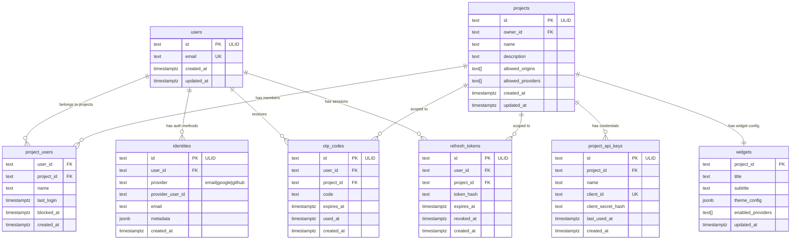

# Data Model: Permit Embedded Authentication

**Feature**: 001-embedded-auth
**Date**: 2026-01-17

## Entity Relationship Diagram



---

## Entities

### users (existing)

Core user identity, shared across all projects.

| Column | Type | Constraints | Notes |
|--------|------|-------------|-------|
| id | TEXT | PK | ULID |
| email | TEXT | UNIQUE, NOT NULL | Primary identifier |
| created_at | TIMESTAMPTZ | NOT NULL | Auto-set |
| updated_at | TIMESTAMPTZ | NOT NULL | Auto-updated |

### identities (NEW)

Tracks authentication methods linked to a user.

| Column | Type | Constraints | Notes |
|--------|------|-------------|-------|
| id | TEXT | PK | ULID |
| user_id | TEXT | FK → users, NOT NULL | Owner |
| provider | TEXT | NOT NULL | `email`, `google`, `github` |
| provider_user_id | TEXT | | External ID from provider |
| email | TEXT | | Email from provider |
| metadata | JSONB | | Provider-specific data (name, avatar) |
| created_at | TIMESTAMPTZ | NOT NULL | |

**Unique constraint**: `(user_id, provider)` - one identity per provider per user

### projects (existing, needs update)

Client application configuration.

| Column | Type | Constraints | Notes |
|--------|------|-------------|-------|
| id | TEXT | PK | ULID |
| owner_id | TEXT | FK → users | Project owner |
| name | TEXT | NOT NULL | Display name |
| description | TEXT | | Optional |
| allowed_origins | TEXT[] | | CORS origins |
| **allowed_providers** | TEXT[] | | 🆕 `['email', 'google', 'github']` |
| created_at | TIMESTAMPTZ | NOT NULL | |
| updated_at | TIMESTAMPTZ | NOT NULL | |

### project_users (existing)

Links users to projects (multi-project support).

| Column | Type | Constraints | Notes |
|--------|------|-------------|-------|
| user_id | TEXT | FK → users | |
| project_id | TEXT | FK → projects | |
| name | TEXT | | Display name in project |
| last_login | TIMESTAMPTZ | | Last auth timestamp |
| blocked_at | TIMESTAMPTZ | | If blocked |
| created_at | TIMESTAMPTZ | | |

**PK**: `(user_id, project_id)`

### project_api_keys (existing)

API credentials for backend verification.

| Column | Type | Constraints | Notes |
|--------|------|-------------|-------|
| id | TEXT | PK | ULID |
| project_id | TEXT | FK → projects | |
| name | TEXT | | Key name |
| client_id | TEXT | UNIQUE | Public identifier |
| client_secret_hash | TEXT | | bcrypt hash |
| last_used_at | TIMESTAMPTZ | | Usage tracking |
| created_at | TIMESTAMPTZ | | |

### widgets (existing)

Widget customization per project.

| Column | Type | Constraints | Notes |
|--------|------|-------------|-------|
| project_id | TEXT | PK, FK → projects | 1:1 with project |
| title | TEXT | DEFAULT 'Welcome' | Modal title |
| subtitle | TEXT | | Optional subtitle |
| theme_config | JSONB | DEFAULT '{}' | Colors, logo, etc. |
| enabled_providers | TEXT[] | | Which auth methods shown |
| updated_at | TIMESTAMPTZ | | |

**theme_config structure**:
```json
{
  "primary_color": "#696FFD",
  "logo_url": "https://...",
  "logo_type": "url|upload|icon",
  "logo_icon_name": "shield",
  "border_radius": "8px",
  "dark_mode": true,
  "show_secured_badge": true,
  "entry_title": "Sign in",
  "terms_url": "https://...",
  "privacy_url": "https://..."
}
```

### otp_codes (existing)

OTP verification codes.

| Column | Type | Constraints | Notes |
|--------|------|-------------|-------|
| id | TEXT | PK | ULID |
| user_id | TEXT | FK → users | |
| project_id | TEXT | FK → projects | |
| code | TEXT | NOT NULL | 6-digit code |
| expires_at | TIMESTAMPTZ | NOT NULL | 10 min from creation |
| used_at | TIMESTAMPTZ | | Null until verified |
| created_at | TIMESTAMPTZ | | |

### refresh_tokens (existing)

Session management tokens.

| Column | Type | Constraints | Notes |
|--------|------|-------------|-------|
| id | TEXT | PK | ULID |
| user_id | TEXT | FK → users | |
| project_id | TEXT | FK → projects | |
| token_hash | TEXT | NOT NULL | SHA-256 hash |
| expires_at | TIMESTAMPTZ | NOT NULL | 7 days from creation |
| revoked_at | TIMESTAMPTZ | | Null until revoked |
| created_at | TIMESTAMPTZ | | |

---

## Migration Required

**New migration**: `002_add_identities_and_providers.sql`

```sql
-- +migrate Up
CREATE TABLE identities (
    id TEXT PRIMARY KEY,
    user_id TEXT NOT NULL REFERENCES users(id) ON DELETE CASCADE,
    provider TEXT NOT NULL,
    provider_user_id TEXT,
    email TEXT,
    metadata JSONB DEFAULT '{}',
    created_at TIMESTAMPTZ NOT NULL DEFAULT NOW(),

    CONSTRAINT uq_user_provider UNIQUE (user_id, provider)
);

CREATE INDEX idx_identities_user ON identities(user_id);
CREATE INDEX idx_identities_provider_email ON identities(provider, email);

ALTER TABLE projects ADD COLUMN IF NOT EXISTS allowed_providers TEXT[] DEFAULT ARRAY['email'];

-- +migrate Down
DROP TABLE IF EXISTS identities;
ALTER TABLE projects DROP COLUMN IF EXISTS allowed_providers;
```

---

## Validation Rules

| Entity | Field | Rule |
|--------|-------|------|
| users | email | Valid email format, lowercase |
| projects | name | 1-100 characters |
| projects | allowed_origins | Valid URLs, max 20 |
| projects | allowed_providers | Subset of `['email', 'google', 'github']` |
| otp_codes | code | 6 digits |
| widgets | theme_config.primary_color | Valid hex color |
