# Data Model: Developer Dashboard

**Feature**: 003-developer-dashboard
**Date**: 2026-01-24
**Updated**: 2026-01-24 (DDD review)

## Design Decisions

### Identity Ownership (DDD Analysis)

**Decision**: Hybrid approach - `identities` linked to `users` (global) + `last_auth_provider` in `project_users` (per-project tracking)

**Rationale**:
- OAuth credentials (provider_user_id) are user-global, not project-scoped
- Avoids re-linking OAuth for each project
- `last_auth_provider` in `project_users` tracks how user authenticated in THAT specific project
- Projects may allow different providers; user experience varies per project

---

## Entities

### User (Global)

Core user entity - unique email across the platform.

| Field | Type | Description |
|-------|------|-------------|
| id | ULID | Primary key |
| email | string | Unique email address |
| created_at | timestamp | Account creation time |
| updated_at | timestamp | Last update time |

**Notes**: Existing table, no changes needed.

---

### Identity (Global)

Linked authentication methods available to a user across all projects.

| Field | Type | Description |
|-------|------|-------------|
| id | ULID | Primary key |
| user_id | ULID | FK to users |
| provider | string | `email`, `google`, `github` |
| provider_user_id | string? | External provider ID (Google sub, GitHub ID) |
| email | string? | Email from provider |
| metadata | JSON? | Additional OAuth data |
| created_at | timestamp | Link creation time |

**Notes**:
- Existing table, FK to `users` (correct per DDD analysis)
- Represents "which auth methods has this user configured globally"
- Unique constraint on `(user_id, provider)`

---

### Project

A customer's project that uses Permit for authentication.

| Field | Type | Description |
|-------|------|-------------|
| id | ULID | Primary key |
| owner_id | ULID | FK to users (developer/owner) |
| name | string | Project display name |
| description | string? | Optional description |
| allowed_origins | string[] | CORS allowed origins |
| allowed_providers | string[] | Enabled auth providers |
| theme_config | JSON | Widget customization |
| created_at | timestamp | Creation time |
| updated_at | timestamp | Last update time |

**Notes**: Existing table, no changes needed.

---

### ProjectUser (Per-Project Membership)

Junction table: user membership in a specific project with project-scoped data.

| Field | Type | Description |
|-------|------|-------------|
| user_id | ULID | FK to users |
| project_id | ULID | FK to projects |
| name | string? | Display name for THIS project |
| last_login | timestamp? | Last login time in THIS project |
| last_auth_provider | string? | **[NEW]** Auth method used (email, google, github) |
| login_count | int | **[NEW]** Total logins in this project |
| blocked_at | timestamp? | When blocked in this project |
| created_at | timestamp | First registration in project |

**Unique Constraint**: `(user_id, project_id)`

**Notes**:
- `name` is project-scoped (user can have different names in different projects)
- `last_login` is project-scoped (login times vary per project)
- `last_auth_provider` answers "HOW did user last login to THIS project?"
- `login_count` tracks engagement per project

---

### APIKey

Credentials for integrating Permit SDK with a project.

| Field | Type | Description |
|-------|------|-------------|
| id | ULID | Primary key |
| project_id | ULID | FK to projects |
| name | string | Display name/description |
| client_id | string | Public identifier |
| client_secret_hash | string | Hashed secret (never exposed) |
| status | string | `active` or `revoked` |
| last_used_at | timestamp? | Last API call time |
| revoked_at | timestamp? | When revoked |
| created_at | timestamp | Creation time |

**Notes**: Existing table, revoke functionality to be added.

---

## ERD

```mermaid
erDiagram
    User ||--o{ Identity : "has (global)"
    User ||--o{ ProjectUser : "member of"
    Project ||--o{ ProjectUser : "has members"
    Project ||--o{ APIKey : "has"
    User ||--o{ Project : "owns"

    User {
        ulid id PK
        string email UK
        timestamp created_at
        timestamp updated_at
    }

    Identity {
        ulid id PK
        ulid user_id FK
        string provider
        string provider_user_id
        string email
        json metadata
        timestamp created_at
    }

    ProjectUser {
        ulid user_id FK
        ulid project_id FK
        string name
        timestamp last_login
        string last_auth_provider
        int login_count
        timestamp blocked_at
        timestamp created_at
    }

    Project {
        ulid id PK
        ulid owner_id FK
        string name
        string description
        json allowed_origins
        json allowed_providers
        json theme_config
        timestamp created_at
        timestamp updated_at
    }

    APIKey {
        ulid id PK
        ulid project_id FK
        string name
        string client_id UK
        string client_secret_hash
        string status
        timestamp last_used_at
        timestamp revoked_at
        timestamp created_at
    }
```



---

## Migration Required

```sql
-- 003_add_project_user_auth_tracking.sql

-- +migrate Up
ALTER TABLE project_users
ADD COLUMN last_auth_provider TEXT,
ADD COLUMN login_count INTEGER DEFAULT 0;

-- +migrate Down
ALTER TABLE project_users
DROP COLUMN last_auth_provider,
DROP COLUMN login_count;
```

---

## Dashboard Query Example

```sql
-- List project users with auth method for dashboard
SELECT
    u.id,
    u.email,
    pu.name,
    pu.last_login,
    pu.last_auth_provider,
    pu.login_count,
    pu.created_at
FROM project_users pu
JOIN users u ON u.id = pu.user_id
WHERE pu.project_id = $1
  AND pu.blocked_at IS NULL
ORDER BY pu.last_login DESC NULLS LAST
LIMIT $2 OFFSET $3;
```
